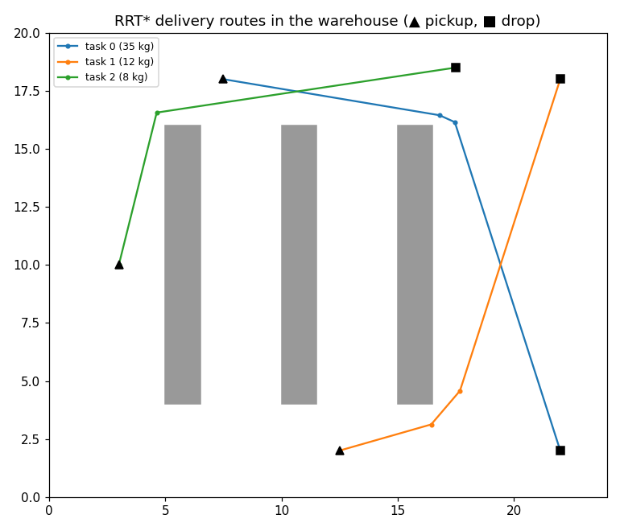

# multi-robot-coordination

A lightweight Python implementation of **multi-robot collaborative manipulation** in a dynamic warehouse: load-based team formation, a leader–follower architecture, centralised task allocation, **RRT\*** path planning and real-time yielding and re-planning around moving people.



## Background

This repository is an independent, simplified re-implementation of the core ideas from:

> A. A. Adil, S. Sakhrieh, J. Mounsef, N. Maalouf. **A multi-robot collaborative manipulation framework for dynamic and obstacle-dense environments: integration of deep learning for real-time task execution.** *Frontiers in Robotics and AI*, 12:1585544, 2025. [doi:10.3389/frobt.2025.1585544](https://doi.org/10.3389/frobt.2025.1585544)

The published system ran in Gazebo with ROS, used MATLAB/Simulink/Stateflow for task scheduling, and detected objects with YOLOv2 on an end-effector RGB-D camera. This repo keeps the coordination logic in plain Python so it can be read, tested and extended without that toolchain.

## How it works

1. **Team formation** – each task has a payload weight; the number of robots is `ceil(weight / capacity)`.
2. **Centralised allocation** – heaviest tasks first; the nearest free robot becomes leader and the next-nearest join as followers. Tasks that cannot be staffed are deferred.
3. **Planning** – RRT\* with rewiring over the static map (shelves), then line-of-sight shortcut smoothing.
4. **Perception** – a `Detector` interface; the bundled `SimulatedDetector` is range-limited and noisy. A real detector (e.g. YOLO) plugs in behind the same interface.
5. **Dynamic obstacles** – the leader yields when a person gets too close, waits when the look-ahead window is blocked, and re-plans if the blockage persists.
6. **Formation** – followers hold fixed offsets around the shared payload during delivery.

## Run

```bash
pip install -e ".[dev]"
python examples/run_warehouse.py --plot   # writes docs/demo.png
pytest
```

```
task 0: leader R4, followers ['R3']        # 35 kg payload -> 2-robot team
task 1: leader R2, followers []
task 2: leader R1, followers []
{'task': 0, 'success': True, 'team_size': 2, 'steps': 290, 'replans': 2, ...}
```

## Layout

```
mrc/world.py        warehouse map, shelves, moving obstacles, collision checks
mrc/rrt_star.py     RRT* + shortcut smoothing
mrc/allocation.py   tasks, robots, team formation, formation offsets
mrc/perception.py   detector interface + simulated detector
mrc/sim.py          path following with yielding and re-planning
```

## License

MIT
